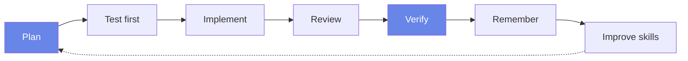
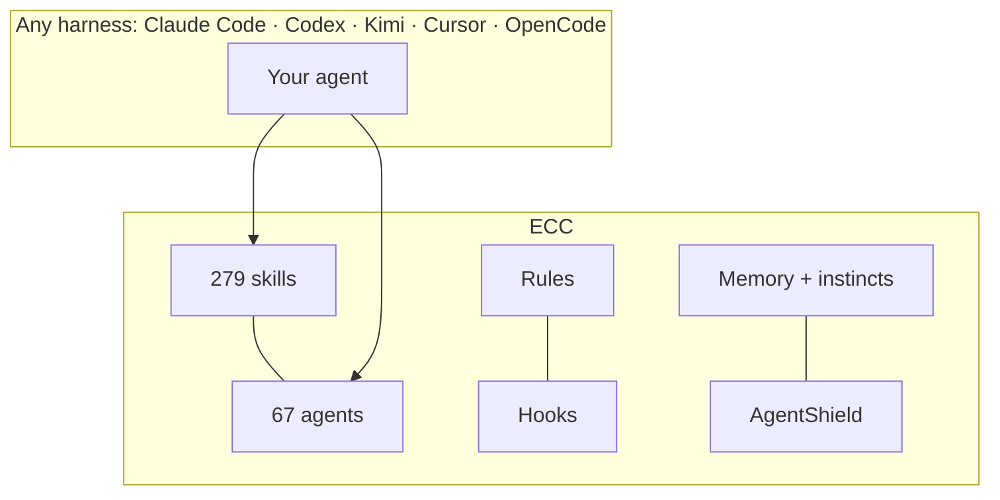
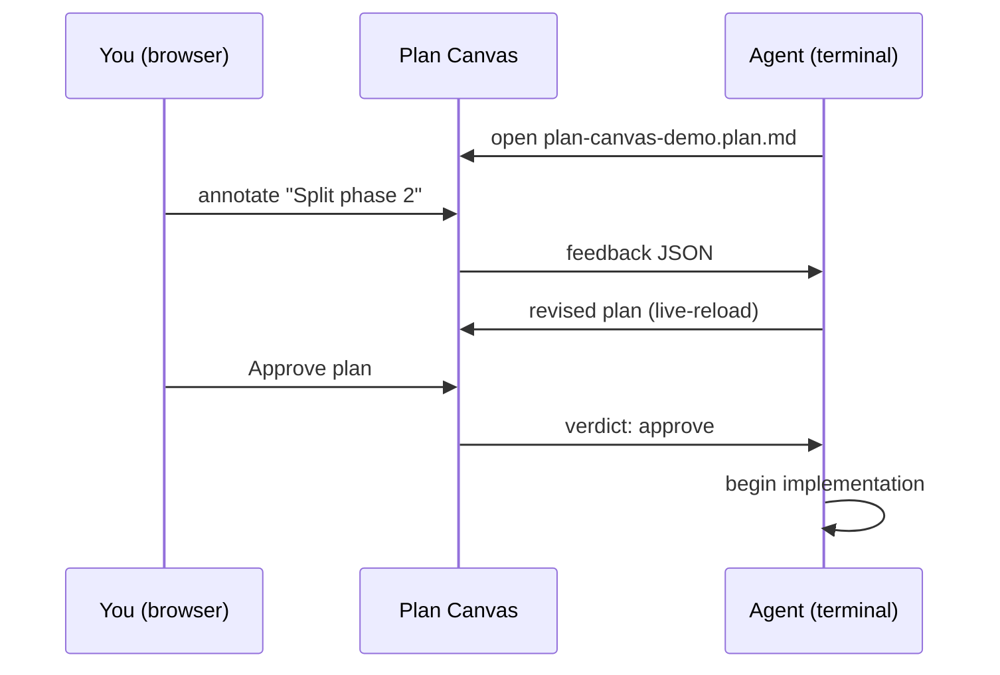

# ECC: The Agent Harness Operating System

> Plan artifact · generated by `/ecc:plan` · review in Plan Canvas, then approve to begin

## What ECC installs into your agent

Your agent can already write code. ECC gives it an engineering system: it plans
before it builds, verifies with tests, reviews its own work from a fresh context,
and turns repeated wins into reusable skills.

## How the pieces fit

| Concept | What it does | Context behavior |
|---|---|---|
| Skills | Reusable workflows: TDD, security review, deep research | Loaded when the task needs them |
| Agents | Scoped workers with their own context and tool permissions | Isolate planning, implementation, review |
| Rules | Durable project or language standards | Always loaded, so install selectively |
| Hooks | Scripts triggered by harness events | Run outside the model context |
| Instincts | Patterns learned from real sessions | Recalled when relevant |

## The review gate you are using right now

`/plan` ends with a hard confirmation gate. Plan Canvas moves that gate from a
wall of terminal markdown to this page. Point at the part you mean, annotate
it, and approve from here.

## Rollout tasks

- [x] Plan Canvas: annotate, chat, approve from the browser
- [x] Kimi Code install target with Moonshot AI
- [x] Verified self-host path on Itô GPUs
- [ ] Ship ECC 2.1 release + announcement
- [x] Demo video (you are watching it)

## Risks

| Risk | Mitigation |
|---|---|
| Plans reviewed as walls of text get skimmed | Canvas renders diagrams + anchored annotations |
| Same context writes and reviews code | Fresh-context reviewer agents |
| Harness config trusted by default | AgentShield scans the harness itself |
