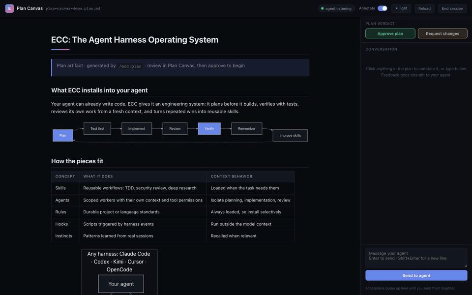

# ECC 2.1.0: Plan Canvas, Kimi Harness, and Self-Hosted Compute

ECC 2.1 turns plan review into a visual loop and opens the harness to self-hosted models. Plan Canvas lets you review agent plans in the browser. Point at the part you mean instead of retyping it in chat. A new Kimi Code install target and a verified Itô GPU path make ECC + open-source models a first-class setup, backed by our public sponsors: Moonshot AI (Kimi), Itô, and Atlas Cloud.

## Plan Canvas: review plans by pointing, not retyping



[Download the MP4 demo](assets/ecc-plan-canvas-demo.mp4)

`/plan` ends with a confirm gate, and until now that review was a wall of markdown in the terminal. Now the agent opens the plan in a loopback-only browser canvas:

- Click elements or select text to attach numbered annotations
- Chat with the agent from a side rail while it works in the terminal
- **Approve plan** / **Request changes** buttons map directly onto `/plan`'s CONFIRM gate
- Mermaid diagrams, tables, and task lists render natively; file edits live-reload the page
- Model- and harness-agnostic: a plain CLI + JSON protocol (`ecc-plan-canvas`), no Claude-only dependency

## Kimi harness: Moonshot AI partnership

ECC now installs directly into [Kimi Code](https://moonshotai.github.io/kimi-cli/) (`--target kimi`). Kimi Code discovers the installed `.kimi/AGENTS.md` instructions and `.kimi/skills/` workflows natively:

```bash
bash ./install.sh --target kimi --profile minimal
npx ecc-universal doctor --target kimi
kimi
```

## Self-host on Itô GPUs

Run ECC against any self-hosted open-source model. If you need GPU capacity, [Itô](https://compute.itomarkets.com) is ECC's preferred compute sponsor. The integration shipped guarded end to end:

- `ecc ito find`: opt-in bridge to the canonical Itô CLI that submits a live, authenticated RFQ (it does not reserve capacity)
- Guarded live node qualification and read-only compute handoff
- Credential-bearing CLI shims are rejected outright

The sponsorship link itself is passive: it does not invoke an RFQ, reserve capacity, provision compute, or configure serving. Managed inference through Itô is not live yet. Any GPU provider works, and ECC stays provider-agnostic.

## Partners

[Moonshot AI (Kimi)](https://www.moonshot.ai), [Itô](https://compute.itomarkets.com), and [Atlas Cloud](https://www.atlascloud.ai) are now public sponsors of ECC. The README documents a recommended self-host path: Itô for GPU capacity, a Kimi checkpoint served behind a compatible endpoint, then Kimi Code + ECC on top. Each choice remains separate and swappable.

## Also in 2.1

- **Hermes and OpenClaw install targets**: two more harnesses join Claude Code, Codex, OpenCode, Cursor, Gemini, Zed, Copilot, and Kimi
- **Codex ECC navigation guide**: find the right skill/command surface from inside Codex
- **GateGuard path exemptions** (`GATEGUARD_EXEMPT_GLOBS`) and configurable instinct injection (count + confidence threshold)
- **PostToolUse hooks consolidated** into sync/async dispatchers, with fewer processes per tool call
- **Supply-chain hardening**: the installer runtime passes strict vetting, and the pre-commit secret scan now catches Anthropic API keys (`sk-ant-...`)
- A long tail of community fixes across OpenCode, Windows, bun lockfiles, the dashboard, and project detection

The catalog now stands at **67 agents, 281 skills, and 94 command shims** (2.0.0 shipped 64/261/84), plus hooks, rules, memory, continuous learning, and AgentShield.

## Install or upgrade

```text
/plugin marketplace add https://github.com/affaan-m/ECC
/plugin install ecc@ecc
```

Existing installs: `/plugin update ecc`

## Community

Join the ECC community for release announcements, questions, and Show and Tell:
<https://discord.gg/36yGMHGFbR>

Full changelog: <https://github.com/affaan-m/ECC/compare/v2.0.0...v2.1.0>
